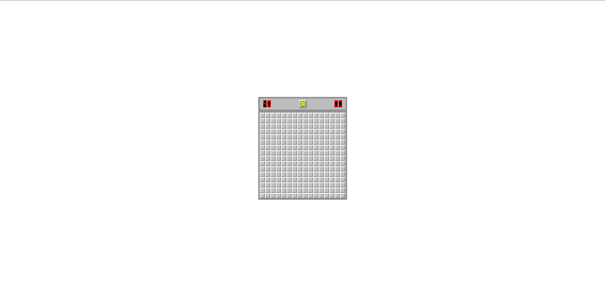

# Minesweeper

**You can also read this README in [English](https://github.com/klekwedge/minesweeper/blob/main/README.EN.md).**

## Оглавление

- [Инструкции по развертыванию](#инструкции-по-развертыванию)
- [Обзор](#обзор)
  - [Описание](#описание)
  - [Скриншот](#скриншот)
  - [Ссылки](#ссылки)
- [Мой процесс](#мой-процесс)
  - [Стек](#стек)
  - [Что я узнал](#что-я-узнал)
- [Автор](#автор)

## Инструкции по развертыванию

**Для запуска проекта на вашем компьютере должны быть установлены [npm](https://nodejs.org/en/) и [git](https://git-scm.com/downloads)**

1. Сделайте клон этого репозитория ```git clone https://github.com/klekwedge/minesweeper.git```
2. Установите все необходимые пакеты npm с помощью ```npm i```
3. Запустите проект командой ```npm run dev```

## Обзор

### Описание

Необходимо написать игру "Сапер", используя HTML, CSS, JavaScript и приложенный спрайт.

#### Требования:

- поле 16x16 клеток,&nbsp;40 мин;
- слева счетчик мин от 40 до нуля, справа секундомер
-	мины расставляются случайно;
-	первый клик никогда не должен быть по мине;
-	если рядом с открытым полем есть другие поля без мин поблизости, они открываются автоматически;
-	правая клавиша ставит флажок - так отмечается место, где предполагается мина;
-	если кликнуть правой кнопкой по флажку, ставится вопрос, еще раз - выделение снимается;
-	клик по смайлику перезапускает игру;
-	испуганный смайлик - пользователь нажал на поле, но еще не отпустил кнопку мышки;
-	после проигрыша смайлик заменяется на грустный, пользователю раскрывается карта мин;
-	после того, как пользователь открыл все поля кроме мин, смайлик надевает солнечные очки, секундомер останавливается.

Ограничений по технологиям, библиотекам и фреймворков нет.

### Скриншот



### Ссылки

- [Ссылка на проект](https://github.com/klekwedge/minesweeper)
- [Деплой](https://klekwedge-minesweeper.vercel.app/)

## Мой процесс

### Стек

- React
- TypeScript
- SCSS
- Chakra UI

### Что я узнал

Понял как работает логика игры «Сапер» и как работать со спрайтами.

## Автор

- [Вебсайт](https://klekwedge-cv.vercel.app/)
- [Linkedin](https://www.linkedin.com/in/klekwedge/)
- [Facebook](https://www.facebook.com/klekwedge)
